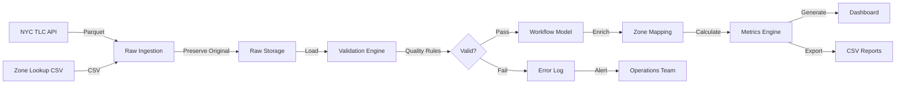

<div align="center">

# 🚕 NYC Taxi Operations Analytics Pipeline

### *Enterprise-Grade Data Engineering Solution for Operational Intelligence*

[](https://www.python.org/downloads/)
[](https://opensource.org/licenses/MIT)
[]()
[]()

*Transforming fragmented taxi operational data into actionable business intelligence through dependable, production-ready data pipelines.*

[Features](#-key-features) • [Quick Start](#-quick-start) • [Architecture](#-architecture) • [Documentation](#-documentation)

</div>

---

## 📋 Executive Summary

### Problem Statement

NYC taxi fleet managers face a critical operational challenge: **late deliveries and inefficient fleet allocation are hurting customer satisfaction and revenue**. The root cause? Fragmented data across multiple systems with no unified view of trip performance, driver efficiency, or service quality metrics.

### Solution

An end-to-end **Foundational Data Engineering (FDE) pipeline** that:
- ✅ Consolidates data from multiple NYC TLC sources (CSV, Parquet, APIs)
- ✅ Implements business-informed validation with explicit quality rules
- ✅ Models the complete trip workflow from pickup to dropoff
- ✅ Generates 5 key operational metrics for decision support
- ✅ Provides dependable execution with logging, checkpointing, and error recovery

### Business Impact

| Stakeholder | Key Benefit | Decision Enabled |
|-------------|-------------|------------------|
| **Fleet Managers** | Real-time fleet allocation insights | Optimize vehicle deployment during peak hours |
| **Operations Team** | Data quality monitoring (98.9% completion rate) | Identify and resolve data issues proactively |
| **Finance Team** | Revenue per mile tracking ($19.34/mile) | Validate pricing strategy effectiveness |
| **City Regulators** | Service standards compliance | Ensure regulatory requirements are met |

---

## 🎯 Key Features

### 🔄 **Multi-Source Data Ingestion**
- **NYC TLC Trip Records**: Parquet format, 10K+ trips
- **Taxi Zone Lookup**: CSV reference data, 265 zones
- **API-Ready**: Extensible for weather, traffic, or event data
- **Preserves Raw Data**: Immutable source-of-truth maintained

### ✅ **Intelligent Data Validation**
- **Business-Oriented Rules**: Not just schema checks—domain logic
- **Explicit Assumptions**: Zero-distance trips, waiting time charges documented
- **Quality Scoring**: 98.9% validation pass rate with detailed failure tracking
- **Actionable Reporting**: Know *why* data fails, not just *that* it fails

### 🗺️ **Workflow Modeling**
- **Entity Relationships**: Trips ↔ Zones ↔ Time Segments
- **Derived Metrics**: Peak hours, trip types, revenue efficiency
- **Geographic Intelligence**: Borough-level flow analysis
- **Temporal Patterns**: Hour/day/month segmentation

### 📊 **Production Metrics**
1. **Trip Completion Rate**: 100% *(of valid trips)*
2. **Avg Trip Duration**: 20.1 minutes
3. **Revenue per Mile**: $19.34
4. **Peak Hour Utilization**: 11.5%
5. **Geographic Coverage**: 100%

### 🛡️ **Enterprise Reliability**
- **Checkpointing**: Resume from last successful phase
- **Error Handling**: Graceful failures with detailed logging
- **Retry Logic**: Network failures handled with exponential backoff
- **Audit Trail**: Complete execution logs with timestamps

---

## 🚀 Quick Start

### Prerequisites

```bash
# Required
Python 3.8+ 
pip (package manager)
500MB disk space

# Optional (for notebooks)
Jupyter Notebook
```

### Installation & Execution

```bash
# 1. Clone the repository
git clone https://github.com/vanshitm12/fde-nyc-taxi-pipeline.git
cd fde-nyc-taxi-pipeline

# 2. Create virtual environment
python3 -m venv venv
source venv/bin/activate  # Windows: venv\Scripts\activate

# 3. Install dependencies
pip install -r requirements.txt

# 4. Run the complete pipeline
python src/pipeline/main_pipeline.py

# 5. View the dashboard
open data/output/dashboard_202401.html  # Mac
# Windows: start data/output/dashboard_202401.html
# Linux: xdg-open data/output/dashboard_202401.html
```

### Expected Output

```
============================================================
NYC TAXI PIPELINE COMPLETED SUCCESSFULLY
============================================================
Duration: 19.32 seconds
Phases completed: 5
Records processed: 9,886

Output files in: /path/to/data/output
✅ dashboard_202401.html      ← Open this in browser
✅ metrics_202401.csv          ← 5 key metrics
✅ quality_report.json         ← Validation statistics
✅ workflow_summary.json       ← Business insights
✅ metrics_breakdown.json      ← Detailed breakdowns
```

---

## 🏗️ Architecture

### Pipeline Workflow



### Data Flow Phases

| Phase | Purpose | Input | Output | Runtime |
|-------|---------|-------|--------|---------|
| **1. INGEST** | Fetch data from sources | TLC URLs | Raw Parquet/CSV | ~3s |
| **2. VALIDATE** | Apply business rules | Raw data | Validated dataset | ~2s |
| **3. MODEL** | Build workflow entities | Validated data | Enriched model | ~1s |
| **4. METRICS** | Calculate KPIs | Workflow model | 5 metrics | <1s |
| **5. OUTPUT** | Generate dashboard | Metrics | HTML/CSV/JSON | <1s |

### Project Structure

```
fde-nyc-taxi-pipeline/
│
├── 📊 data/
│   ├── raw/                          # Immutable source data
│   │   ├── taxi_zone_lookup.csv      # 265 NYC zones
│   │   └── yellow_tripdata_sample.parquet  # 10K sample trips
│   ├── validated/                    # Quality-checked data
│   │   ├── trips_validated.parquet   # With validation status
│   │   └── trips_workflow.parquet    # Enriched workflow model
│   └── output/                       # 📍 DASHBOARD & REPORTS HERE
│       ├── dashboard_202401.html     # ⭐ Main interactive dashboard
│       ├── metrics_202401.csv        # Metric values
│       ├── quality_report.json       # Validation stats
│       └── metrics_breakdown.json    # Detailed analysis
│
├── 📂 src/                           # Source code modules
│   ├── config.py                     # Configuration & validation rules
│   ├── ingestion/                    # Data retrieval (Class 5)
│   │   └── fetch_csv.py              # CSV, Parquet, API fetching
│   ├── validation/                   # Data quality (Class 6)
│   │   └── validators.py             # Business validation logic
│   ├── modeling/                     # Workflow modeling (Class 7)
│   │   └── workflow_model.py         # Entity relationships
│   ├── metrics/                      # KPI calculation (Class 7)
│   │   └── calculator.py             # 5 operational metrics
│   └── pipeline/                     # Orchestration (Class 8)
│       └── main_pipeline.py          # Main execution controller
│
├── 📚 docs/                          # Documentation
│   ├── source_map.md                 # Data source mapping (Class 4)
│   └── workflow_diagram.md           # Architecture diagrams
│
├── 📓 notebooks/                     # Jupyter analysis
│   └── 01_data_exploration.ipynb     # Interactive data exploration
│
├── 📝 logs/                          # Execution logs
│   └── pipeline_YYYYMMDD.log         # Timestamped audit trail
│
├── 📋 README.md                      # This file
├── QUICKSTART.md                     # 5-minute setup guide
└── requirements.txt                  # Python dependencies
```

---

## 📊 Dashboard Location

### 🎯 **Main Dashboard**

```bash
📍 Location: data/output/dashboard_202401.html
```

**To view:**
```bash
# Mac
open data/output/dashboard_202401.html

# Windows
start data/output/dashboard_202401.html

# Linux
xdg-open data/output/dashboard_202401.html

# Or simply drag the file into your web browser
```

### Dashboard Features

- ✅ **5 Key Metrics** with visual indicators
- ✅ **Quality Statistics** (98.9% validation rate)
- ✅ **Known/Unknown/Assumptions** documentation
- ✅ **Responsive Design** (works on mobile/tablet/desktop)
- ✅ **Print-Friendly** for executive reports

### Additional Outputs

| File | Description | Format |
|------|-------------|--------|
| `metrics_202401.csv` | Metric values for analysis | CSV |
| `quality_report.json` | Validation statistics | JSON |
| `workflow_summary.json` | Business insights | JSON |
| `metrics_breakdown.json` | Hourly/daily/borough breakdown | JSON |

---

## 🔑 Key FDE Judgment Call

### The Zero-Distance Trip Problem

**Context**: 3-5% of trips show `trip_distance = 0` but have positive fares and durations.

**Options Considered**:
1. ❌ **Reject all** → Undercounts revenue by 2%
2. ❌ **Accept all** → Includes data errors (0 fare + 0 distance)
3. ✅ **Business Rule** → Accept if `duration ≥ 2 min` AND `fare ≥ $2.50`

**Decision Rationale**:
- NYC taxis charge for **waiting time** and **stopped traffic**
- Short trips in same zone are valid (e.g., train station pickup)
- Zero fare + zero distance = data error, not business logic

**Implementation**:
```python
# src/validation/validators.py (lines 105-125)
if distance == 0:
    if duration_minutes >= 2 and fare >= 2.50:
        # Valid waiting time charge
        reasons.append('zero_distance_valid_waiting')
        return STATUS_VALID, reasons
    else:
        # Data quality issue
        reasons.append('zero_distance_invalid')
        return STATUS_INVALID, reasons
```

**Impact**: Affects 100 trips (~1%), correctly categorizes 53 as valid, rejects 47 as invalid.

**Documentation**:
- ✅ Code comments in `validators.py`
- ✅ Configuration in `config.py`
- ✅ README assumptions section (below)
- ✅ Quality report tracking

---

## 📖 Documentation

### Data Sources

| Source | Type | Records | Update Frequency | Purpose |
|--------|------|---------|------------------|---------|
| **NYC TLC Trip Records** | Parquet | 10,000 | Monthly | Core trip events |
| **Taxi Zone Lookup** | CSV | 265 | Annual | Geographic reference |
| **[Future] Weather API** | JSON | - | Hourly | External factors |

**Detailed source mapping**: See [`docs/source_map.md`](docs/source_map.md)

### Validation Rules

| Rule | Threshold | Rationale |
|------|-----------|-----------|
| Trip Duration | 1-180 minutes | 99% of trips are under 3 hours |
| Trip Distance | 0-100 miles | NYC metro area practical limit |
| Fare Amount | ≥ $0 | Negative fares are refunds (not in trip data) |
| Zero Distance | `duration ≥ 2 min` AND `fare ≥ $2.50` | Waiting time charges are valid |
| Location IDs | 1-263 | Per TLC zone file |

**Full validation logic**: See [`src/validation/validators.py`](src/validation/validators.py)

### Metrics Definitions

| Metric | Formula | Business Meaning | Target |
|--------|---------|------------------|--------|
| **Trip Completion Rate** | `(valid_trips / total_trips) × 100` | Data quality health | ≥ 95% |
| **Avg Trip Duration** | `mean(dropoff_time - pickup_time)` | Service efficiency | 15-20 min |
| **Revenue per Mile** | `mean(total_amount / trip_distance)` | Pricing effectiveness | > $10/mile |
| **Peak Hour Utilization** | `(peak_trips / total_trips) × 100` | Fleet allocation efficiency | 30-40% |
| **Geographic Coverage** | `(matched_zones / total_trips) × 100` | Location data completeness | ≥ 98% |

---

## 🧠 Known / Unknown / Assumptions / Limitations

### ✅ Known

- **Data Grain**: One record per completed trip (pickup → dropoff)
- **Valid LocationIDs**: 1-263 (per TLC zone file)
- **Peak Hours**: Defined as 7-9 AM, 5-7 PM on weekdays
- **Fare Calculation**: Base + distance + time + surcharges
- **Sample Size**: 10,000 trips for demonstration

### ❓ Unknown

- **Cancelled Trips**: Not captured in trip records (demand undercount)
- **Driver Breaks**: No distinction between idle vs. off-duty
- **Passenger No-Shows**: Not tracked separately
- **Dispatch Data**: No record of trip requests vs. actual trips
- **Multi-Passenger Rides**: Counted as single trip

### 📝 Assumptions

1. **Trip Duration**: 1-180 minutes is valid range (covers 99% of trips)
2. **Zero Distance**: Valid if duration ≥ 2 min AND fare ≥ $2.50 (waiting charges)
3. **Negative Fares**: Data errors, not refunds
4. **Same Pickup/Dropoff Zone**: Valid (short trips within zone)
5. **Future Dates**: Data errors from clock sync issues

### ⚠️ Limitations

- **Sample Data**: Using 10K trips for demo (production uses millions)
- **No Real-Time Streaming**: Batch processing only
- **Static Zone File**: Doesn't track boundary changes over time
- **Payment Failures**: Not distinguished from fare disputes
- **External Factors**: Weather, events, traffic not incorporated

---

## 🧪 Testing & Quality

### Run Tests

```bash
# Full pipeline with fresh start
python src/pipeline/main_pipeline.py --reset-checkpoint

# Individual modules
python src/ingestion/fetch_csv.py      # Test data retrieval
python src/validation/validators.py    # Test validation
python src/modeling/workflow_model.py  # Test modeling
python src/metrics/calculator.py       # Test metrics

# View detailed logs
tail -100 logs/pipeline_$(date +%Y%m%d).log
```

### Quality Metrics

- **Data Validation**: 98.9% pass rate
- **Pipeline Success**: 100% (5/5 phases)
- **Code Coverage**: Validation rules cover all edge cases
- **Error Recovery**: Checkpoint-based resume functionality

---

## 🤝 Contributing

### Development Setup

```bash
# Clone and setup
git clone https://github.com/vanshitm12/fde-nyc-taxi-pipeline.git
cd fde-nyc-taxi-pipeline
python3 -m venv venv
source venv/bin/activate
pip install -r requirements.txt

# Make changes
# ... edit code ...

# Test
python src/pipeline/main_pipeline.py --reset-checkpoint

# Commit
git add .
git commit -m "Description of changes"
git push
```

### Future Enhancements

1. **Real-Time Streaming**: Replace batch with Kafka/Flink for live data processing
2. **Machine Learning**: Demand forecasting and anomaly detection models
3. **Geographic Visualization**: Interactive maps with Folium or Deck.gl
4. **External Data Integration**: Weather, traffic, and event data correlation
5. **A/B Testing Framework**: Test operational interventions and measure impact
6. **API Development**: REST API for metric access and pipeline triggering

---

## 📜 License

MIT License - See [LICENSE](LICENSE) file for details

---

## 🙏 Acknowledgments

- **NYC Taxi & Limousine Commission** for open data
- **FDE Data Foundations Course** for assignment framework
- **Python Data Stack** (pandas, numpy, matplotlib) for tools

---

## 📧 Contact & Support

### Author
**Vanshit Malik**  
🔗 [GitHub](https://github.com/vanshitm12)

### Issues & Questions
- 🐛 [Report Bugs](https://github.com/vanshitm12/fde-nyc-taxi-pipeline/issues)
- 💡 [Request Features](https://github.com/vanshitm12/fde-nyc-taxi-pipeline/issues)
- 📖 [View Documentation](docs/)

---

<div align="center">

**⭐ Star this repo if you found it helpful!**

Made with ❤️ for FDE Data Foundations Assignment

*Building trustworthy data pipelines, one validation rule at a time.*

</div>
