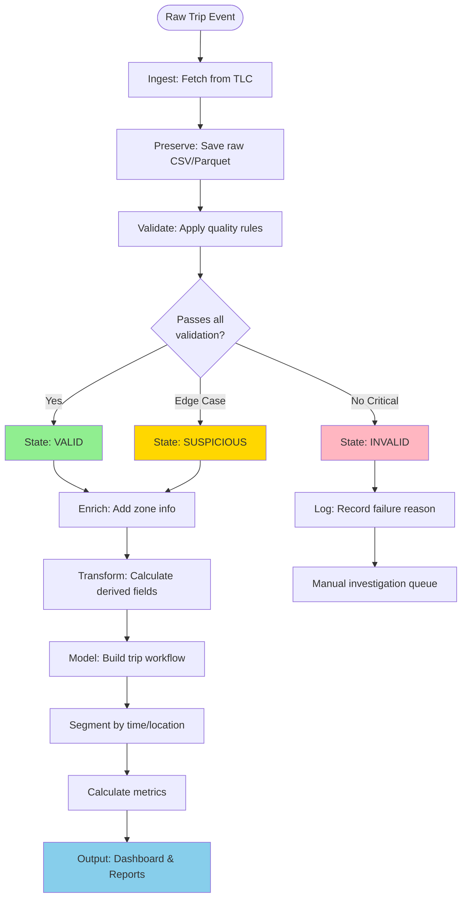
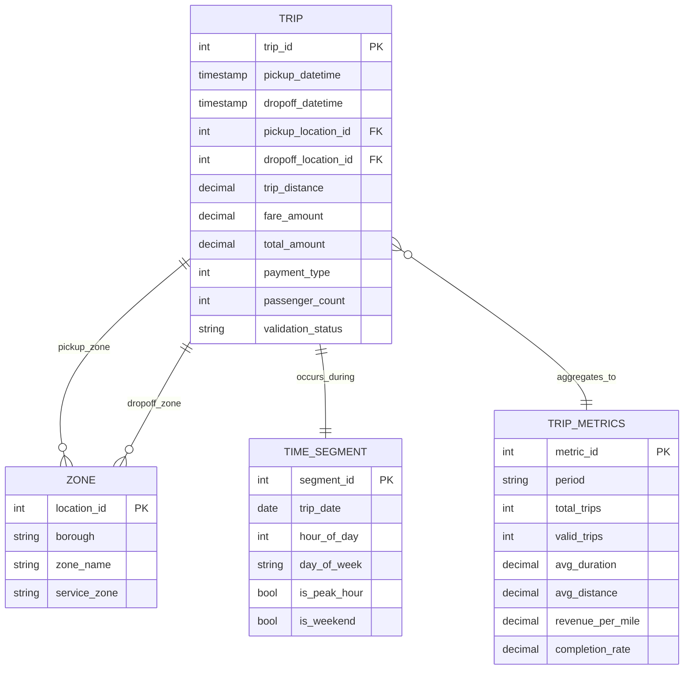
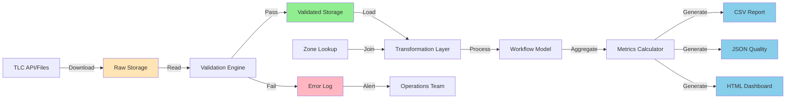

# Workflow Diagram

## Trip Workflow State Machine



## Entity Relationship Model



## Data Flow Pipeline



## Pipeline Orchestration

```
┌─────────────────────────────────────────────────────────────┐
│                     MAIN PIPELINE                            │
│                                                              │
│  ┌────────────┐  ┌────────────┐  ┌────────────┐           │
│  │  PHASE 1   │  │  PHASE 2   │  │  PHASE 3   │           │
│  │  INGEST    │→ │  VALIDATE  │→ │  TRANSFORM │           │
│  └────────────┘  └────────────┘  └────────────┘           │
│        ↓              ↓                ↓                    │
│   [Raw Files]   [Quality Report]  [Enriched Data]          │
│                                                              │
│  ┌────────────┐  ┌────────────┐                            │
│  │  PHASE 4   │  │  PHASE 5   │                            │
│  │  MODEL     │→ │  METRICS   │                            │
│  └────────────┘  └────────────┘                            │
│        ↓              ↓                                     │
│  [Workflow DB]   [Dashboard + Reports]                     │
│                                                              │
│  ┌──────────────────────────────────────┐                  │
│  │     CROSS-CUTTING CONCERNS           │                  │
│  │  • Logging (every phase)             │                  │
│  │  • Error handling (try/catch/log)    │                  │
│  │  • Progress tracking (% complete)    │                  │
│  │  • Checkpointing (resume on failure) │                  │
│  │  • Alerting (critical failures)      │                  │
│  └──────────────────────────────────────┘                  │
└─────────────────────────────────────────────────────────────┘
```

## Metric Calculation Flow

```
Valid Trips (filtered)
    │
    ├─→ Count → Trip Completion Rate = valid / total * 100
    │
    ├─→ Duration Calc → avg(dropoff_time - pickup_time)
    │
    ├─→ Revenue Calc → avg(total_amount / trip_distance)
    │                   [exclude distance = 0]
    │
    ├─→ Time Filter → Peak Hours (7-9 AM, 5-7 PM weekdays)
    │              → Peak Utilization = peak_trips / total * 100
    │
    └─→ Zone Join → Count distinct zones
                 → Coverage Quality = matched / total * 100
```

## Validation Decision Tree

```
Trip Record
    │
    ├─ Is pickup_time valid datetime?
    │   NO → INVALID (reason: bad_pickup_time)
    │   YES ↓
    │
    ├─ Is dropoff_time > pickup_time?
    │   NO → INVALID (reason: time_paradox)
    │   YES ↓
    │
    ├─ Is duration < 180 minutes?
    │   NO → SUSPICIOUS (reason: extremely_long_trip)
    │   YES ↓
    │
    ├─ Is trip_distance >= 0 and < 100 miles?
    │   NO → INVALID (reason: impossible_distance)
    │   YES ↓
    │
    ├─ Is trip_distance = 0?
    │   YES → Check duration > 2 min AND fare > $2.50
    │         YES → VALID (reason: waiting_time_charge)
    │         NO → INVALID (reason: zero_distance_zero_fare)
    │   NO ↓
    │
    ├─ Is fare_amount < 0?
    │   YES → INVALID (reason: negative_fare)
    │   NO ↓
    │
    ├─ Are location IDs in range 1-263?
    │   NO → SUSPICIOUS (reason: unknown_zone)
    │   YES ↓
    │
    └─ VALID (passed all checks)
```

## Key Business Rules

### Rule 1: Trip Duration Bounds
- **Min:** 1 minute (excludes spurious records)
- **Max:** 180 minutes (3 hours - flags unusual trips)
- **Rationale:** 99% of trips are under 2 hours; >3 hours likely data error or exceptional case

### Rule 2: Distance Validation
- **Min:** 0 miles (allow stopped traffic charges)
- **Max:** 100 miles (NYC metro area practical limit)
- **Special:** 0 distance requires duration >= 2 min AND fare >= $2.50
- **Rationale:** Zero distance can be valid (waiting charges) but not zero time+fare

### Rule 3: Fare Validation
- **Min:** $0 (allow no-charge trips)
- **No negative:** Refunds not in trip records
- **Max:** None (no upper bound, some trips to airports are expensive)
- **Rationale:** Negative fares are data errors, not business logic

### Rule 4: Geographic Validation
- **LocationID:** Must be 1-263 per zone lookup
- **Exception:** 264-265 appear in data - flag as SUSPICIOUS not INVALID
- **Same pickup/dropoff:** VALID (short trips within zone)
- **Rationale:** Strict validation on known IDs, graceful handling of edge cases

### Rule 5: Time Validation
- **Pickup:** Must be valid datetime, not future
- **Dropoff:** Must be after pickup
- **Max lookback:** No limit (historical data OK)
- **Rationale:** Logical consistency required, historical analysis accepted

## Operational Workflow States

### VALID
- Passed all validation rules
- Included in metrics calculations
- ~95-97% of trips expected

### SUSPICIOUS
- Edge case that needs review
- Included in metrics with flag
- Logged for manual investigation
- Examples: very long trips, unknown zones
- ~1-3% of trips expected

### INVALID
- Critical validation failure
- Excluded from metrics
- Logged with specific reason code
- Examples: negative fare, time paradox, missing required fields
- ~1-2% of trips expected

## Pipeline Failure Handling

### Failure Types

**Transient Failures:**
- Network timeout during download
- **Action:** Retry up to 3 times with exponential backoff
- **Log:** Warning level

**Data Quality Failures:**
- High % of invalid trips (>10%)
- **Action:** Complete pipeline, raise alert, flag report
- **Log:** Warning level + alert

**Critical Failures:**
- Cannot download source data
- Cannot write to output
- Code exception/crash
- **Action:** Stop pipeline, log full traceback, send alert
- **Log:** Error level + alert

### Checkpointing
- After each phase completes, write checkpoint file
- On restart, check for checkpoint and resume from last completed phase
- Prevents re-downloading data on validation failure

### Idempotency
- Pipeline can be run multiple times for same period
- Overwrites previous output files
- Raw data preserved (never deleted by pipeline)
